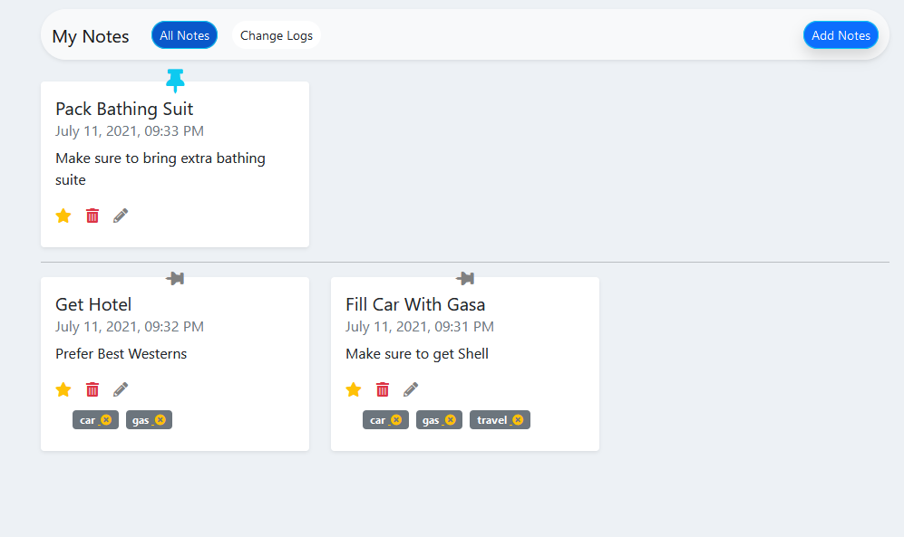
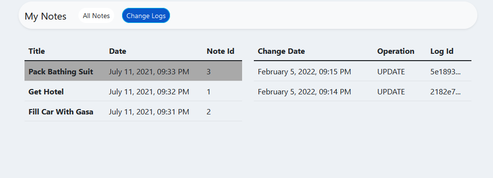
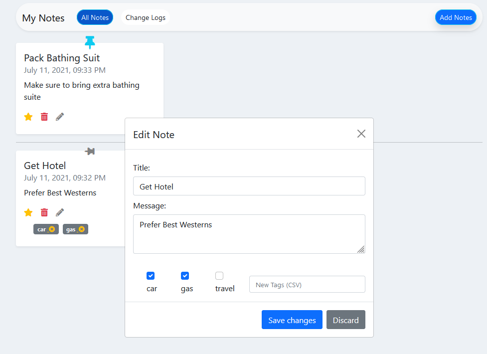

# note-app-reactjs

first app I created while learning react js stack.

how to run

`npm install`

Then, do run the app you just need type

`npm run dev`

---

### App UI

Demo App : https://pita-note-app.netlify.app/
